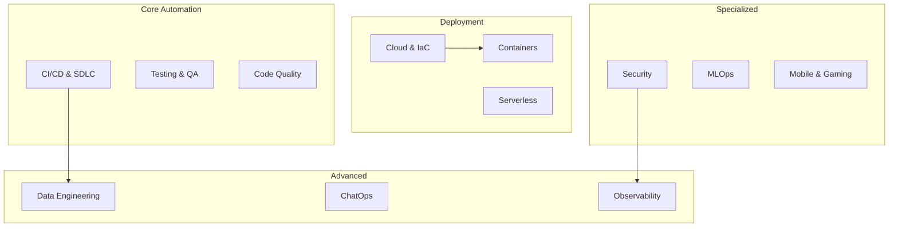
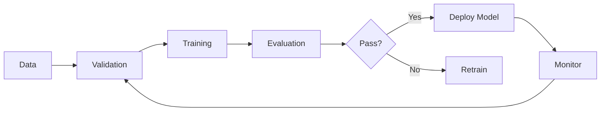
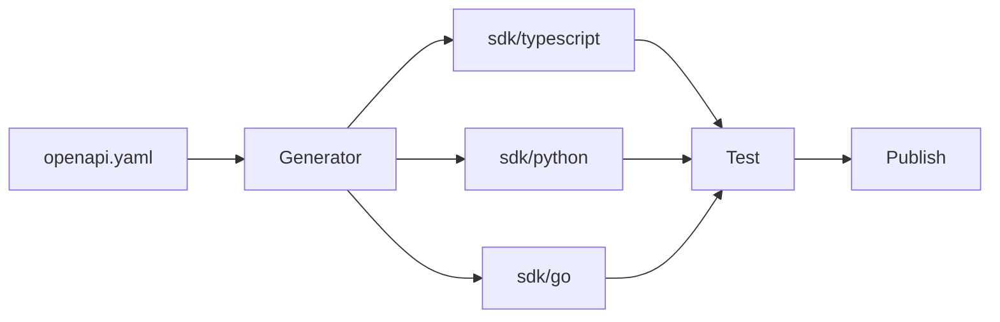

# 🚀 Awesome GitHub Workflows

[](https://awesome.re)
[](LICENSE)
[](https://github.com/frangelbarrera/awesome-workflows/stargazers)
[](https://github.com/frangelbarrera/awesome-workflows/graphs/contributors)
[](https://github.com/frangelbarrera/awesome-workflows/commits/main)
[](https://github.com/frangelbarrera/awesome-workflows/actions/workflows/lint-workflows.yml)

> **The Ultimate Collection of Production-Ready GitHub Actions Workflows**
>
> A curated, comprehensive guide to automate every aspect of your development and operations lifecycle.

⭐ **Star this repository** if you find it useful!

---

## 📊 Quick Stats

| Metric | Value |
|--------|-------|
| Categories | 32 |
| Workflow Templates | 50+ |
| Resources & Tools | 200+ |
| Community Contributors | Open |

---

## 🎯 Why This Repository?

This repository serves as a **one-stop destination** for developers, DevOps engineers, and teams looking to leverage GitHub Actions to automate their workflows. Whether you're setting up a simple CI pipeline or implementing complex multi-stage deployments, you'll find practical examples, templates, and best practices here.

### What You'll Find

| Feature | Description |
|---------|-------------|
| ✅ Production-Ready | Copy-paste YAML templates tested in real projects |
| ✅ Comprehensive | Covers 32 categories from CI/CD to MLOps |
| ✅ Best Practices | Security, optimization, and performance included |
| ✅ Community Driven | Open to contributions and improvements |
| ✅ Well Documented | Each workflow includes explanations and links |

---

## 📋 Table of Contents

### Getting Started
- [🚀 Quick Start](#-quick-start)
- [📖 Contributing Guide](CONTRIBUTING.md)
- [🔒 Security Policy](SECURITY.md)
- [🤝 Code of Conduct](CODE_OF_CONDUCT.md)
- [📋 Issue Templates](.github/ISSUE_TEMPLATE/)
- [🔧 Pull Request Template](.github/PULL_REQUEST_TEMPLATE.md)

### Workflow Categories

| # | Category | Description | Templates |
|---|----------|-------------|-----------|
| 01 | [Software Development Lifecycle (SDLC)](#-1-software-development-lifecycle-sdlc) | CI/CD, testing, versioning, release management | ✅ |
| 02 | [Web Development](#-2-web-development-frontend--backend) | Frontend, backend, deployment, testing | ✅ |
| 03 | [Mobile App Development](#-3-mobile-app-development) | iOS, Android, cross-platform builds | ✅ |
| 04 | [Cybersecurity (DevSecOps)](#-4-cybersecurity-devsecops) | Security scanning, vulnerability analysis | ✅ |
| 05 | [Infrastructure & Operations](#-5-infrastructure--operations-devopsinfra-as-code) | Terraform, Pulumi, Ansible automation | ✅ |
| 06 | [Network Automation](#-6-network-automation) | Network device configuration and management | ✅ |
| 07 | [Data Science & MLOps](#-7-data-science--machine-learning-mlops) | ML lifecycle, model deployment | ✅ |
| 08 | [Task Automation & Project Management](#-8-task-automation--project-management) | Issue management, notifications | ✅ |
| 09 | [Documentation as Code](#-9-documentation-as-code-docs-as-code) | Auto-generated docs, deployment | ✅ |
| 10 | [Content Management & Publishing](#-10-content-management--publishing-content-ops) | Blog automation, cross-posting | ✅ |
| 11 | [Code Quality & Metrics Analysis](#-11-code-quality--metrics-analysis) | Coverage, complexity, quality gates | ✅ |
| 12 | [Automated Refactoring & Upgrades](#-12-automated-refactoring--upgrades) | Codemods, dependency updates | ✅ |
| 13 | [Game Development](#-13-game-development-gamedev-cicd) | Unity, Godot, Unreal builds | ✅ |
| 14 | [Blockchain & Smart Contracts](#-14-blockchain--smart-contract-development) | Smart contract testing & deployment | ✅ |
| 15 | [IoT & Embedded Systems](#-15-iot--embedded-systems-development) | Cross-compilation, firmware | ✅ |
| 16 | [Data Engineering & ETL](#-16-data-engineering--etl-pipelines) | Data transformation, orchestration | ✅ |
| 17 | [Container Orchestration](#-17-container-orchestration-advanced-kubernetesecs) | Kubernetes, Helm, ECS deployments | ✅ |
| 18 | [Serverless Architecture](#-18-serverless-architecture-automation) | Lambda, Functions, Serverless Framework | ✅ |
| 19 | [Package & Library Publishing](#-19-package--library-publishing) | npm, PyPI, Docker, NuGet | ✅ |
| 20 | [SDK Generation & Deployment](#-20-sdk-generation--deployment) | OpenAPI generators, client SDKs | ✅ |
| 21 | [Performance & Load Testing](#-21-performance--load-testing) | k6, JMeter, Artillery | ✅ |
| 22 | [Chaos Engineering](#-22-chaos-engineering--resilience-testing) | Resilience, fault injection | ✅ |
| 23 | [Open Source Community Management](#-23-open-source-community-management) | Contributor recognition, triage | ✅ |
| 24 | [Repository Synchronization](#-24-repository--ecosystem-synchronization) | Multi-repo sync, fork management | ✅ |
| 25 | [CI/CD Pipeline Security](#-25-cicd-pipeline-security-software-supply-chain) | SLSA, provenance, signing | ✅ |
| 26 | [Cost Management & FinOps](#-26-cost-management--workflow-optimization-finops) | Cost monitoring, optimization | ✅ |
| 27 | [Workflow Observability](#-27-workflow-observability--monitoring) | Metrics, monitoring, dashboards | ✅ |
| 28 | [Engineering Metrics (DORA)](#-28-engineering-performance-metrics-dora) | Deployment frequency, lead time | ✅ |
| 29 | [Incident Management](#-29-incident-management-automation) | PagerDuty, incident response | ✅ |
| 30 | [ChatOps Integration](#-30-advanced-collaboration-integration-chatops) | Slack, Teams, notifications | ✅ |
| 31 | [HPC & Scientific Workflows](#-31-high-performance-computing-hpc--scientific-workflows) | Slurm, Nextflow, research | ✅ |
| 32 | [Desktop Application CI/CD](#-32-desktop-application-cicd) | Electron, Tauri, Qt, .NET MAUI | ✅ |

---

## 🚀 Quick Start

### Basic CI Pipeline

```yaml
name: CI Pipeline
on:
  push:
    branches: [main, develop]
  pull_request:
    branches: [main]

jobs:
  build:
    runs-on: ubuntu-latest
    permissions:
      contents: read
      id-token: write
    
    steps:
      - name: Checkout code
        uses: actions/checkout@v4
      
      - name: Setup Node.js
        uses: actions/setup-node@v4
        with:
          node-version: '20'
          cache: 'npm'
      
      - name: Install dependencies
        run: npm ci
      
      - name: Run tests
        run: npm test
      
      - name: Build
        run: npm build
```

### Matrix Build Example

```yaml
jobs:
  test:
    runs-on: ${{ matrix.os }}
    strategy:
      fail-fast: false
      matrix:
        os: [ubuntu-latest, windows-latest, macos-latest]
        node-version: [18, 20, 22]
        exclude:
          - os: windows-latest
            node-version: 22
    
    steps:
      - uses: actions/checkout@v4
      - name: Setup Node.js ${{ matrix.node-version }}
        uses: actions/setup-node@v4
        with:
          node-version: ${{ matrix.node-version }}
      - name: Install and test
        run: npm ci && npm test
```

---

## 📦 Categories Overview



---

## 📖 Category Details

---

### **1. Software Development Lifecycle (SDLC)**

Automating the core software development lifecycle, including continuous integration, testing, versioning, and release management.

**Core Tools:**
- [GitHub Actions](https://docs.github.com/en/actions)
- [GitVersion](https://gitversion.net/)
- [Semantic Release](https://github.com/semantic-release/semantic-release)

**Key Workflows:**
- Automated version bumping
- Changelog generation
- Release creation
- Artifact publishing

**Resources:**
| Resource | Description |
|----------|-------------|
| [Official Starter Workflows](https://github.com/actions/starter-workflows) | Ready-to-use templates |
| [Awesome Actions](https://github.com/sdras/awesome-actions) | Curated action list |
| [Caching Dependencies](https://github.com/actions/cache) | Speed up builds |

---

### **2. Web Development (Frontend & Backend)**

Workflows for building, testing, and deploying modern websites and web applications.

**Frontend Tools:**
- [Cypress](https://docs.cypress.io/guides/continuous-integration/github-actions) - E2E Testing
- [Playwright](https://playwright.dev/docs/ci) - Browser Automation
- [Lighthouse CI](https://github.com/GoogleChrome/lighthouse-ci) - Performance Audits

**Backend Tools:**
- [PostgreSQL](https://github.com/marketplace/actions/run-postgresql) - Database Testing
- [Newman](https://github.com/postman-labs/newman-action) - API Testing

**Deployments:**
| Platform | Action |
|----------|--------|
| GitHub Pages | [actions/deploy-pages](https://github.com/actions/deploy-pages) |
| Vercel | [vercel/action](https://github.com/vercel/vercel/tree/main/packages/cli) |
| Netlify | [netlify/actions/build](https://github.com/netlify/actions) |

---

### **3. Mobile App Development**

Automating the build, signing, and distribution process for iOS and Android apps.

**Core Tools:**
- [Fastlane](https://fastlane.tools/) - Mobile automation
- [Xcode Setup](https://github.com/maxim-lobanov/setup-xcode)
- [Android SDK](https://github.com/android-actions/setup-android)

**Distribution Channels:**
| Channel | Platform | Action |
|---------|----------|--------|
| TestFlight | iOS | [fastlane](https://docs.fastlane.tools/actions/testflight/) |
| Google Play | Android | [google-play-publish](https://github.com/r0adkll/upload-google-play) |
| Firebase | Both | [firebase-distribute](https://github.com/wzieba/Firebase-Distribution-GitHub-Action) |

---

### **4. Cybersecurity (DevSecOps)**

Integrating security scans, vulnerability analysis, and compliance checks into the pipeline.

**Security Tools:**

| Category | Tools | Purpose |
|----------|-------|---------|
| SAST | [CodeQL](https://github.com/github/codeql-action), [SonarCloud](https://github.com/SonarSource/sonarcloud-github-action) | Static code analysis |
| SCA | [Snyk](https://github.com/snyk/actions), [Dependabot](https://github.com/dependabot) | Dependency scanning |
| Secrets | [TruffleHog](https://github.com/trufflesecurity/truffleHog), [GitLeaks](https://github.com/gitleaks/gitleaks-action) | Secret detection |
| DAST | [OWASP ZAP](https://github.com/marketplace/actions/owasp-zap-scan) | Dynamic analysis |
| Containers | [Trivy](https://github.com/aquasecurity/trivy-action), [Snyk Container](https://github.com/snyk/actions/container) | Image scanning |

**Best Practices:**
- ✅ Run security scans on every PR
- ✅ Block merges with critical vulnerabilities
- ✅ Use pinned action versions (SHA)
- ✅ Apply least privilege permissions

---

### **5. Infrastructure & Operations (DevOps/ IaC)**

Automating the provisioning and management of Infrastructure as Code.

**IaC Tools:**

| Tool | Official Action | Use Case |
|------|-----------------|----------|
| Terraform | [hashicorp/setup-terraform](https://github.com/hashicorp/setup-terraform) | Cloud infrastructure |
| Pulumi | [pulumi/actions](https://github.com/pulumi/actions) | Infrastructure as code |
| Ansible | [ansible/ansible-lint-action](https://github.com/ansible/ansible-lint-action) | Configuration management |
| AWS | [aws-actions/configure-aws-credentials](https://github.com/aws-actions/configure-aws-credentials) | AWS deployments |
| Azure | [azure/login](https://github.com/Azure/login) | Azure deployments |
| GCP | [google-github-actions/auth](https://github.com/google-github-actions/auth) | Google Cloud |

---

### **6. Network Automation**

Applying CI/CD principles to network configuration and management.

**Key Tools:**
- [Ansible](https://www.ansible.com/) - Network automation
- [Batfish](https://www.batfish.org/) - Network configuration analysis
- [ZeroTier](https://www.zerotier.com/) - Secure runner connectivity

**Resources:**
- [Awesome Network Automation](https://github.com/networktocode/awesome-network-automation)
- [Network Automation with GitHub Actions](https://www.rogerperkin.co.uk/network-automation/what-are-github-actions/)

---

### **7. Data Science & Machine Learning (MLOps)**

Automating the machine learning model lifecycle.

**Core Tools:**

| Tool | Purpose | GitHub Action |
|------|---------|---------------|
| [CML](https://cml.dev/) | Continuous ML | [iterative/cml](https://github.com/iterative/cml) |
| [DVC](https://dvc.org/) | Data versioning | [iterative/setup-dvc](https://github.com/iterative/setup-dvc) |
| [MLflow](https://mlflow.org/) | ML lifecycle | [mlflow/mlflow](https://github.com/mlflow/mlflow) |
| [Weights & Biases](https://wandb.com/) | Experiment tracking | [wandb/wandb-action](https://github.com/wandb/wandb-action) |

**MLOps Workflow:**


---

### **8. Task Automation & Project Management**

Automating repository maintenance and project workflows.

**Key Actions:**
| Action | Purpose |
|--------|---------|
| [actions/stale](https://github.com/actions/stale) | Close inactive issues |
| [actions/labeler](https://github.com/actions/labeler) | Auto-label issues/PRs |
| [actions/add-to-project](https://github.com/actions/add-to-project) | Add items to projects |
| [alex-page/github-project-automation-plus](https://github.com/alex-page/github-project-automation-plus) | Project card automation |

---

### **9. Documentation as Code (Docs-as-Code)**

Treating documentation with the same rigor as code.

**Static Site Generators:**
- [MkDocs](https://www.mkdocs.org/) - Python-based
- [Docusaurus](https://docusaurus.io/) - React-based
- [Hugo](https://gohugo.io/) - Go-based
- [Sphinx](https://www.sphinx-doc.org/) - Python docs standard

**Doc Workflows:**
| Tool | Purpose |
|------|---------|
| [Lychee](https://github.com/lycheeverse/lychee) | Broken link checking |
| [Check Spelling](https://github.com/client9/misspell) | Spell checking |
| [Vale](https://errata-ai.github.io/vale/) | Style linting |
| [Deploy Pages](https://github.com/actions/deploy-pages) | Publish to GitHub Pages |

---

### **10. Content Management & Publishing**

Automating content lifecycle from creation to distribution.

**Workflows:**
- Blog post scheduling
- Image optimization
- Cross-posting to multiple platforms
- Newsletter generation

**Key Actions:**
| Platform | Action |
|----------|--------|
| DEV.to | [dev-to-publish](https://github.com/akshatshrma-devto-action) |
| Medium | [medium-publish](https://github.com/marketplace/actions/medium-publish) |
| X/Twitter | [post-to-twitter](https://github.com/v intermediates/twitter-tweet) |
| LinkedIn | [linkedin-post](https://github.com/zoellner/linkedin-action) |

---

### **11. Code Quality & Metrics Analysis**

Going beyond linting to track and enforce quality.

**Quality Tools:**

| Tool | Purpose | Action |
|------|---------|--------|
| SonarCloud | Code quality | [sonarcloud-scan](https://github.com/sonarSource/sonarcloud-github-action) |
| CodeClimate | Quality analysis | [codeclimate-action](https://github.com/marketplace/actions/codeclimate-action) |
| Codecov | Coverage reporting | [codecov-action](https://github.com/codecov/codecov-action) |
| Coveralls | Coverage tracking | [coveralls-github-action](https://github.com/coverallsapp/github-action) |

---

### **12. Automated Refactoring & Upgrades**

Using workflows for large-scale automated changes.

**Tools:**
| Tool | Purpose |
|------|---------|
| [jscodeshift](https://github.com/facebook/jscodeshift) | JS/TS codemods |
| [Sourcery](https://sourcery.ai/) | AI refactoring |
| [Dependabot](https://github.com/dependabot) | Auto dependency updates |
| [Renovate](https://www.mend.io/renovate/) | Advanced dependency management |

---

### **13. Game Development (GameDev CI/CD)**

CI/CD for game engines and development.

**Game Engines:**
| Engine | Action | Purpose |
|--------|--------|---------|
| Unity | [game-ci/unity-builder](https://github.com/game-ci/unity-builder) | Build |
| Unity | [game-ci/unity-test-runner](https://github.com/game-ci/unity-test-runner) | Test |
| Godot | [godot-export](https://github.com/marketplace/actions/godot-export) | Export |
| Unreal | [uetools](https://github.com/astar-org/uetools) | Build |

**Deployment:**
| Platform | Action |
|----------|--------|
| Steam | [steam-deploy](https://github.com/marketplace/actions/steam-deploy) |
| Itch.io | [butler-push](https://github.com/marketplace/actions/butler-push) |

---

### **14. Blockchain & Smart Contract Development**

Automating smart contract testing and deployment.

**Tools:**
| Tool | Purpose |
|------|---------|
| [Hardhat](https://hardhat.org/) | Ethereum development |
| [Foundry](https://book.getfoundry.sh/) | Fast Rust-based toolkit |
| [Truffle](https://trufflesuite.com/) | Development framework |

**Workflows:**
- Automated testing with `forge test` or `npx hardhat test`
- Contract deployment with [hardhat-deploy](https://github.com/wighawag/hardhat-deploy)
- Gas usage reporting

---

### **15. IoT & Embedded Systems Development**

Workflows for cross-compilation and firmware.

**Core Tools:**
| Tool | Purpose |
|------|---------|
| [PlatformIO](https://platformio.org/) | Embedded development |
| [QEMU](https://www.qemu.org/) | Emulation and testing |
| [Docker](https://www.docker.com/) | Consistent build environments |

**Actions:**
- [setup-arm-toolchain](https://github.com/marketplace/actions/setup-arm-toolchain)
- [platformio-github-action](https://github.com/marketplace/actions/platformio-github-action)

---

### **16. Data Engineering & ETL Pipelines**

CI/CD for data transformation and orchestration.

**Tools:**
| Tool | Purpose | Action |
|------|---------|--------|
| [dbt](https://www.getdbt.com/) | Data transformation | [dbt-cloud](https://github.com/marketplace/actions/dbt-cloud-github-action) |
| [Great Expectations](https://greatexpectations.io/) | Data quality | Custom scripts |
| [Airflow](https://airflow.apache.org/) | Orchestration | Sync DAGs |

---

### **17. Container Orchestration (Kubernetes/ECS)**

Advanced workflows for container orchestration.

**Kubernetes Tools:**
| Tool | Purpose | Action |
|------|---------|--------|
| kubectl | Cluster interaction | [azure-kubectl-action](https://github.com/Azure/kubectl-action) |
| Helm | Package manager | [helm-chart-releaser](https://github.com/helm/chart-releaser-action) |
| Kustomize | Configuration | [kustomize-build](https://github.com/marketplace/actions/kustomize-build) |
| Argo CD | GitOps CD | [argocd](https://github.com/argoproj/argo-cd/) |

---

### **18. Serverless Architecture Automation**

Deploying serverless applications.

**Frameworks:**
| Framework | Purpose | Action |
|-----------|---------|--------|
| Serverless Framework | Multi-cloud | [serverless/github-action](https://github.com/serverless/github-action) |
| AWS SAM | AWS Lambda | [setup-sam](https://github.com/aws-actions/setup-sam) |
| Terraform | Infrastructure | [hashicorp/setup-terraform](https://github.com/hashicorp/setup-terraform) |

---

### **19. Package & Library Publishing**

Automating release and publication.

**Package Registries:**

| Registry | Language | Action |
|----------|----------|--------|
| npm | JavaScript | [npm-publish](https://github.com/npm/publish) |
| PyPI | Python | [pypi-publish](https://github.com/marketplace/actions/pypi-publish) |
| Maven | Java | [setup-java](https://github.com/actions/setup-java) |
| Docker Hub | Containers | [docker/login-action](https://github.com/docker/login-action) |
| NuGet | .NET | [nuget-context](https://github.com/NuGet/setup-nuget) |

---

### **20. SDK Generation & Deployment**

Auto-generating client SDKs from API specifications.

**Tools:**
| Tool | Purpose |
|------|---------|
| [OpenAPI Generator](https://openapi-generator.tech/) | Generate SDKs |
| [gRPC-Gateway](https://grpc-ecosystem.github.io/grpc-gateway/) | REST to gRPC |
| [Fern](https://www.buildwithfern.com/) | Modern SDK generation |

**Workflow:**


---

### **21. Performance & Load Testing**

Automating performance tests.

**Tools:**
| Tool | Purpose | GitHub Action |
|------|---------|---------------|
| [k6](https://k6.io/) | Load testing | [k6-load-test](https://github.com/grafana/k6-github-action) |
| [JMeter](https://jmeter.apache.org/) | Performance testing | [jmeter-action](https://github.com/marketplace/actions/jmeter-action) |
| [Artillery](https://www.artillery.io/) | Load testing | [artillery-action](https://github.com/artilleryio/artillery-action) |

---

### **22. Chaos Engineering & Resilience Testing**

Intentional failure injection for resilience.

**Tools:**
| Tool | Purpose | Action |
|------|---------|--------|
| [LitmusChaos](https://litmuschaos.io/) | K8s chaos | [litmuschaos-action](https://github.com/marketplace/actions/litmuschaos-github-action) |
| [Chaos Mesh](https://chaos-mesh.org/) | Fault injection | [chaos-mesh-action](https://github.com/chaos-mesh/chaos-mesh) |
| [AWS FIS](https://aws.amazon.com/fis/) | AWS fault injection | AWS SDK |

---

### **23. Open Source Community Management**

Automating community nurturing.

**Key Actions:**
| Action | Purpose |
|--------|---------|
| [welcome](https://github.com/actions/welcome) | Welcome first contributors |
| [all-contributors](https://github.com/all-contributors/all-contributors-bot) | Recognize contributors |
| [stale](https://github.com/actions/stale) | Close inactive issues |
| [labeler](https://github.com/actions/labeler) | Auto-label PRs |
| [auto-assign](https://github.com/marketplace/actions/auto-assign-action) | Assign reviewers |

---

### **24. Repository & Ecosystem Synchronization**

Multi-repo automation and sync.

**Tools:**
| Tool | Purpose |
|------|---------|
| [Fork Sync](https://github.com/marketplace/actions/fork-sync) | Keep forks updated |
| [Repo Sync](https://github.com/marketplace/actions/github-sync) | Mirror repositories |
| [Template Sync](https://github.com/marketplace/actions/repo-template-sync) | Sync template changes |

---

### **25. CI/CD Pipeline Security (Software Supply Chain)**

Securing the pipeline itself.

**Frameworks:**
| Framework | Purpose |
|-----------|---------|
| [SLSA](https://slsa.dev/) | Supply chain security |
| [Sigstore](https://www.sigstore.dev/) | Artifact signing |
| [StepSecurity](https://www.stepsecurity.io/) | Runtime security |

**Key Actions:**
| Action | Purpose |
|--------|---------|
| [attest-build-provenance](https://github.com/actions/attest-build-provenance) | SLSA provenance |
| [dependency-review-action](https://github.com/actions/dependency-review-action) | Dependency review |
| [harden-runner](https://github.com/step-security/harden-runner) | Runtime security |

---

### **26. Cost Management & FinOps**

Monitoring and optimizing CI/CD costs.

**Strategies:**
| Strategy | Description |
|----------|-------------|
| Caching | [actions/cache](https://github.com/actions/cache) |
| Concurrency | Cancel redundant runs |
| Path Filtering | Trigger only on changes |
| Self-hosted Runners | Cost savings for large builds |

**Actions:**
| Action | Purpose |
|--------|---------|
| [actions-usage-metrics](https://github.com/marketplace/actions/github-actions-usage-metrics) | Track usage |
| [infracost](https://github.com/infracost/infracost) | Cost estimation |

---

### **27. Workflow Observability & Monitoring**

Monitoring CI/CD performance.

**Tools:**
| Tool | Purpose |
|------|---------|
| [Datadog](https://www.datadoghq.com/) | CI visibility |
| [New Relic](https://newrelic.com/) | Performance monitoring |
| [Prometheus](https://prometheus.io/) | Metrics collection |
| [Grafana](https://grafana.com/) | Dashboards |

---

### **28. Engineering Performance Metrics (DORA)**

Measuring DevOps performance.

**DORA Metrics:**
| Metric | Description |
|--------|-------------|
| Deployment Frequency | How often you deploy |
| Lead Time for Changes | Commit to production time |
| Change Failure Rate | % of deployments causing failures |
| Time to Restore | Recovery time after incidents |

**Actions:**
| Action | Purpose |
|--------|---------|
| [dora-metrics](https://github.com/marketplace/actions/dora-metrics) | Collect DORA metrics |
| [Google Four Keys](https://github.com/GoogleCloudPlatform/four-keys) | Visualization |

---

### **29. Incident Management Automation**

Integrating with incident platforms.

**Tools:**
| Platform | Action |
|----------|--------|
| PagerDuty | [pagerduty-github-action](https://github.com/marketplace/actions/pagerduty-github-action) |
| Opsgenie | [opsgenie-action](https://github.com/marketplace/actions/opsgenie-action) |
| ServiceNow | [servicenow-action](https://github.com/marketplace/actions/servicenow-action) |

---

### **30. ChatOps Integration**

Bidirectional communication with chat platforms.

**Integration:**
| Platform | Purpose |
|----------|---------|
| Slack | Notifications & commands |
| Microsoft Teams | Team collaboration |
| Discord | Community notifications |

**Actions:**
| Action | Purpose |
|--------|---------|
| [slack-github-action](https://github.com/slackapi/slack-github-action) | Slack notifications |
| [teams-action](https://github.com/adaptdk/teams-action) | MS Teams messages |
| [discord-notify](https://github.com/klaasnicolaas/discord-action) | Discord updates |

---

### **31. High-Performance Computing (HPC)**

Scientific computing and research workflows.

**Tools:**
| Tool | Purpose |
|------|---------|
| [Slurm](https://slurm.schedmd.com/) | HPC workload manager |
| [Nextflow](https://www.nextflow.io/) | Scientific workflows |
| [Snakemake](https://snakemake.github.io/) | Pipeline automation |

**Workflow Pattern:**
```yaml
jobs:
  hpc-job:
    runs-on: ubuntu-latest
    steps:
      - uses: actions/checkout@v4
      - name: SSH to HPC
        uses: appleboy/ssh-action@v1
        with:
          host: ${{ secrets.HPC_HOST }}
          username: ${{ secrets.HPC_USER }}
          key: ${{ secrets.HPC_KEY }}
          script: |
            sbatch run_job.sh
```

---

### **32. Desktop Application CI/CD**

Building, signing, and distributing desktop apps.

**Frameworks:**
| Framework | Platform | Action |
|-----------|----------|--------|
| Electron | Cross-platform | [electron-builder](https://github.com/electron-userland/electron-builder) |
| Tauri | Cross-platform | [tauri-action](https://github.com/tauri-apps/tauri-action) |
| .NET MAUI | Windows/macOS | [setup-dotnet](https://github.com/actions/setup-dotnet) |
| Qt | Cross-platform | [qt-ci](https://github.com/qt-labs/qt-ci) |

**Code Signing:**
| Platform | Action |
|----------|--------|
| macOS | [macos-code-signing](https://github.com/marketplace/actions/macos-code-signing) |
| Windows | [windows-code-signing](https://github.com/marketplace/actions/windows-code-signing) |

---

## 🛠️ Best Practices

### Security Hardening

```yaml
permissions:
  contents: read
  id-token: write  # Only if needed
  pull-requests: write
  actions: read

# Pin to SHA instead of tags
uses: actions/checkout@11bd71901bbe5b1630ceea73d27597364c9af683  # v4.2.2

# Use secrets, never hardcode
env:
  AWS_ROLE_ARN: ${{ secrets.AWS_ROLE_ARN }}
```

### Performance Optimization

```yaml
# Cache dependencies
- uses: actions/cache@v4
  with:
    path: |
      ~/.npm
      ${{ env.HOME }}/.cache/Cypress
    key: ${{ runner.os }}-deps-${{ hashFiles('**/package-lock.json') }}
    restore-keys: |
      ${{ runner.os }}-deps-

# Cancel redundant runs
concurrency:
  group: ${{ github.workflow }}-${{ github.ref }}
  cancel-in-progress: true
```

---

## 🤝 Contributing

Contributions are welcome! Please read our [Contributing Guide](CONTRIBUTING.md) for details.

### How to Contribute

1. **Fork** the repository
2. **Create** a feature branch (`git checkout -b feature/amazing-workflow`)
3. **Add** your workflow to `.github/workflows/`
4. **Commit** your changes (`git commit -m 'Add amazing workflow'`)
5. **Push** to the branch (`git push origin feature/amazing-workflow`)
6. **Open** a Pull Request

---

## 📄 License

This project is licensed under the MIT License - see the [LICENSE](LICENSE) file for details.

---

## 🙏 Acknowledgments

- [GitHub Actions](https://github.com/features/actions) for an incredible platform
- [Awesome Actions](https://github.com/sdras/awesome-actions) for inspiration
- All contributors who help make this repository amazing

---

## 📬 Contact

- **GitHub Issues**: For bugs and feature requests
- **Discussions**: For questions and general discussion
- **Twitter**: [@frangelbarrera](https://twitter.com/frangelbarrera)

---

<div align="center">

**⭐ Star this repository if you found it useful! ⭐**

Made with ❤️ by the community

</div>
